# FileUI v005 - VFX File Manager Plan

```mermaid
flowchart TB
    subgraph "🎨 From v003"
        A[BSP Panel System]
        B[Preview Mode]
        C[Drag & Drop]
        D[Undo/Redo]
        E[Pin/Collapse]
    end
    
    subgraph "✨ From Main"
        F[Bright Teal #00cc8b]
        G[Colorful File Types]
        H[Lucide Icons]
    end
    
    subgraph "🎬 New in v005"
        I[VFX File Browser]
        J[Image/Video Preview]
        K[Metadata Display]
    end
    
    subgraph "📦 Deploy Anywhere"
        L[Local Python Server]
        M[Cloudflare Workers]
        N[Static Hosting]
    end
    
    A & B & C & D & E --> O{FileUI v005}
    F & G & H --> O
    I & J & K --> O
    O --> L
    O --> M
    O --> N
    
    style O fill:#00cc8b,stroke:#fff,stroke-width:4px,color:#fff
    style A fill:#252526,stroke:#00cc8b,color:#fff
    style B fill:#252526,stroke:#00cc8b,color:#fff
    style C fill:#252526,stroke:#00cc8b,color:#fff
    style D fill:#252526,stroke:#00cc8b,color:#fff
    style E fill:#252526,stroke:#00cc8b,color:#fff
    style F fill:#f7b2ad,stroke:#fff,color:#000
    style G fill:#ffe066,stroke:#fff,color:#000
    style H fill:#7ec4cf,stroke:#fff,color:#000
    style I fill:#b5ead7,stroke:#fff,color:#000
    style J fill:#c3aed6,stroke:#fff,color:#000
    style K fill:#4ec9b0,stroke:#fff,color:#000
```



## The Vision
A beautiful, functional file manager for VFX and media professionals that works everywhere - locally on any OS and on Cloudflare.

## What We're Building
**v005 = v003's amazing panels + Main's vibrant colors + VFX file management**

## Core Features We're Keeping

### From v003 (The Magic):
✅ **BSP Panel System** - Unlimited splits for comparing shots  
✅ **Preview Mode** - See where panels land before dropping  
✅ **Panel States** - Pin reference images, collapse metadata  
✅ **Drag-to-Collapse** - Drag panels small to minimize  
✅ **Alignment Guides** - Visual helpers when dragging  
✅ **Undo/Redo** - Full layout history (Ctrl+Z/Y)  
✅ **Save/Load Layouts** - Export/import workspace layouts  

### From Main Version (The Beauty):
✅ **Vibrant Colors** - Bright teal accent (#00cc8b)  
✅ **File Type Colors** - Pink for 3D, blue for comp, yellow for images  
✅ **Lucide Icons** - Clean, modern icons  
✅ **Better Contrast** - Easier on the eyes during long sessions  

### New in v005 (VFX Features):
✅ **File Browser** - Navigate project hierarchies  
✅ **Image Viewer** - EXR, DPX, TIFF with proper color management  
✅ **Video Player** - MOV, MP4 with frame-by-frame control  
✅ **Metadata Display** - Frame range, resolution, codec info  
✅ **Batch Operations** - Rename sequences, move shots  
✅ **Multi-Platform** - Works on Cloudflare & locally  

## Super Simple File Structure
```
v005/
├── index.html        # Everything starts here
├── panels.js         # v003's magic (copy as-is)
├── style.css         # v003 styles + VFX colors
├── filemanager.js    # NEW: File browsing & metadata
├── viewers.js        # NEW: Image/video preview
└── server.py         # NEW: File operations & metadata extraction
```

## VFX File Type Support

### 3D Files
- **Blender**: .blend
- **Maya**: .ma, .mb
- **Houdini**: .hip, .hipnc
- **Cinema 4D**: .c4d
- **3ds Max**: .max
- **Universal**: .fbx, .obj, .usd, .abc

### Compositing
- **Nuke**: .nk
- **After Effects**: .aep
- **Fusion**: .comp

### Images
- **High-end**: .exr, .dpx, .tiff
- **Standard**: .png, .jpg, .tga
- **Layered**: .psd, .xcf

### Video
- **Professional**: .mov, .mxf, .r3d, .ari
- **Standard**: .mp4, .avi
- **Image Sequences**: name.####.ext

## Implementation Plan

### Phase 1: Get File Browsing Working (Day 1)
**Goal: Browse and view file metadata**

1. **Copy from v003:**
   ```bash
   cp v003/panels3.html v005/index.html
   cp v003/panels3.js v005/panels.js
   cp v003/panels3.css v005/style.css
   ```

2. **Update colors in style.css:**
   ```css
   :root {
       /* From main version */
       --accent: #00cc8b;        /* Bright teal */
       --bg-main: #1e1e1e;       /* Dark background */
       --bg-panel: #252526;      /* Panel background */
       
       /* VFX File Type Colors */
       --file-3d: #f7b2ad;       /* Pink - 3D files */
       --file-comp: #7ec4cf;     /* Light blue - Compositing */
       --file-image: #ffe066;    /* Yellow - Images */
       --file-video: #c3aed6;    /* Purple - Video */
       --file-project: #b5ead7;  /* Mint - Projects */
   }
   ```

3. **Create filemanager.js:**
   ```javascript
   // File browser functionality
   async function loadDirectory(path) {
       const response = await fetch(`/api/files?path=${path}`);
       const files = await response.json();
       return files;
   }
   
   function getFileType(filename) {
       const ext = filename.split('.').pop().toLowerCase();
       const types = {
           '3d': ['blend', 'ma', 'mb', 'hip', 'c4d', 'fbx', 'obj', 'usd'],
           'comp': ['nk', 'aep', 'comp'],
           'image': ['exr', 'dpx', 'tiff', 'png', 'jpg', 'tga'],
           'video': ['mov', 'mp4', 'mxf', 'r3d', 'ari']
       };
       
       for (const [type, extensions] of Object.entries(types)) {
           if (extensions.includes(ext)) return type;
       }
       return 'unknown';
   }
   ```

4. **Create server.py with metadata extraction:**
   ```python
   from http.server import HTTPServer, BaseHTTPRequestHandler
   import json
   import os
   import struct
   from urllib.parse import urlparse, parse_qs
   
   class VFXFileHandler(BaseHTTPRequestHandler):
       def get_file_metadata(self, filepath):
           """Extract metadata based on file type"""
           metadata = {
               'name': os.path.basename(filepath),
               'size': os.path.getsize(filepath),
               'modified': os.path.getmtime(filepath)
           }
           
           ext = filepath.split('.')[-1].lower()
           
           # EXR metadata extraction
           if ext == 'exr':
               # Basic EXR header parsing
               with open(filepath, 'rb') as f:
                   # Read EXR magic number and version
                   magic = f.read(4)
                   if magic == b'\x76\x2f\x31\x01':
                       metadata['format'] = 'OpenEXR'
                       # Additional EXR parsing would go here
           
           # Add more format-specific metadata extraction
           
           return metadata
   ```

5. **Update panels.js:**
   - Replace markdown editing with file browser panel
   - Add metadata display panel
   - Add image/video viewer panel

### Phase 2: Add Viewers (Day 2)
- **Image Viewer**: Canvas-based EXR/DPX viewer with zoom/pan
- **Video Player**: HTML5 video with frame stepping
- **Metadata Panel**: Display technical details
- **Thumbnail Generator**: For file browser

### Phase 3: Multi-Platform Support (Day 3)

#### Local Mode (Any OS):
```bash
python server.py
# Opens at http://localhost:3000
```

#### Browser-Only Mode:
- Uses File System Access API
- Limited to local file preview only

#### Cloudflare Mode:
- Browse files stored in R2
- Generate thumbnails with Workers
- Cache metadata in KV

### Phase 4: Advanced Features (Day 4)
- **Batch Rename**: Rename image sequences
- **File Operations**: Copy, move, delete with confirmation
- **Sequence Detection**: Group image sequences
- **Quick Filters**: Filter by type, date, size

### Phase 5: Polish & Integration (Day 5)
- **Keyboard Shortcuts**: Quick navigation
- **Drag & Drop**: Import files
- **Export Lists**: CSV of file paths
- **Watch Folders**: Auto-refresh on changes

## Deployment Options

### 1. Local Studio Pipeline
```bash
# Run on local workstation or shared server
python server.py --root /path/to/projects
```

### 2. Cloudflare R2 Integration
```javascript
// Store assets in R2, browse via Workers
export default {
    async fetch(request, env) {
        // List R2 objects, generate signed URLs
    }
}
```

### 3. Hybrid Mode
- Local server for file operations
- Cloudflare for sharing/review

## Key Principles
1. **Performance First** - Handle thousands of files smoothly
2. **Respect Color Space** - Proper handling of linear/sRGB
3. **Sequence Aware** - Treat image sequences as single items
4. **Pipeline Friendly** - Integrate with existing tools
5. **Keep the Magic** - Don't lose v003's amazing panels

## What Makes This Special
- **VFX Focused** - Built for production needs
- **Beautiful Design** - Vibrant colors that pop
- **Powerful Panels** - Compare shots side by side
- **Works Everywhere** - Local, cloud, or hybrid
- **Metadata Rich** - See all technical details

## Success Checklist
- [ ] Day 1: Browse files and see metadata
- [ ] Day 2: Preview images and play videos
- [ ] Day 3: Works on Cloudflare R2
- [ ] Day 4: Batch operations functional
- [ ] Day 5: Feels like a pro tool

## Complete Python Server (server.py)
```python
from http.server import HTTPServer, BaseHTTPRequestHandler
import json
import os
import mimetypes
from urllib.parse import urlparse, parse_qs
import struct

class VFXFileHandler(BaseHTTPRequestHandler):
    def get_file_metadata(self, filepath):
        """Extract metadata based on file type"""
        stat = os.stat(filepath)
        metadata = {
            'name': os.path.basename(filepath),
            'path': filepath,
            'size': stat.st_size,
            'modified': stat.st_mtime,
            'type': self.get_file_type(filepath)
        }
        
        # Add type-specific metadata
        ext = filepath.split('.')[-1].lower()
        
        if ext in ['jpg', 'png', 'tiff', 'exr', 'dpx']:
            # Add image dimensions if possible
            metadata['category'] = 'image'
        elif ext in ['mov', 'mp4', 'mxf']:
            metadata['category'] = 'video'
        elif ext in ['blend', 'ma', 'mb', 'hip', 'c4d']:
            metadata['category'] = '3d'
            
        return metadata
    
    def get_file_type(self, filename):
        ext = filename.split('.')[-1].lower()
        type_map = {
            '3d': ['blend', 'ma', 'mb', 'hip', 'c4d', 'fbx', 'obj', 'usd'],
            'comp': ['nk', 'aep', 'comp'],
            'image': ['exr', 'dpx', 'tiff', 'png', 'jpg', 'tga'],
            'video': ['mov', 'mp4', 'mxf', 'r3d', 'ari']
        }
        
        for ftype, extensions in type_map.items():
            if ext in extensions:
                return ftype
        return 'unknown'
    
    def do_GET(self):
        url = urlparse(self.path)
        
        if url.path == '/api/files':
            # List directory with metadata
            dirpath = parse_qs(url.query).get('path', ['.'])[0]
            try:
                files = []
                for item in sorted(os.listdir(dirpath)):
                    filepath = os.path.join(dirpath, item)
                    if os.path.isfile(filepath):
                        files.append(self.get_file_metadata(filepath))
                    else:
                        files.append({
                            'name': item,
                            'path': filepath,
                            'type': 'directory',
                            'isDirectory': True
                        })
                
                self.send_response(200)
                self.send_header('Content-Type', 'application/json')
                self.send_header('Access-Control-Allow-Origin', '*')
                self.end_headers()
                self.wfile.write(json.dumps(files).encode())
            except Exception as e:
                self.send_error(404, str(e))
                
        elif url.path == '/api/file':
            # Serve file for preview
            filepath = parse_qs(url.query).get('path', [''])[0]
            try:
                mime_type, _ = mimetypes.guess_type(filepath)
                with open(filepath, 'rb') as f:
                    self.send_response(200)
                    self.send_header('Content-Type', mime_type or 'application/octet-stream')
                    self.send_header('Access-Control-Allow-Origin', '*')
                    self.end_headers()
                    self.wfile.write(f.read())
            except:
                self.send_error(404)
        else:
            # Serve static files
            filepath = 'index.html' if url.path == '/' else url.path[1:]
            try:
                with open(filepath, 'rb') as f:
                    self.send_response(200)
                    self.send_header('Access-Control-Allow-Origin', '*')
                    self.end_headers()
                    self.wfile.write(f.read())
            except:
                self.send_error(404)
    
    def do_OPTIONS(self):
        self.send_response(200)
        self.send_header('Access-Control-Allow-Origin', '*')
        self.send_header('Access-Control-Allow-Methods', 'GET, POST, OPTIONS')
        self.send_header('Access-Control-Allow-Headers', 'Content-Type')
        self.end_headers()

print('FileUI VFX Server running at http://localhost:3000')
HTTPServer(('', 3000), VFXFileHandler).serve_forever()
```

That's it! A complete VFX file manager leveraging v003's amazing panel system.